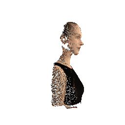
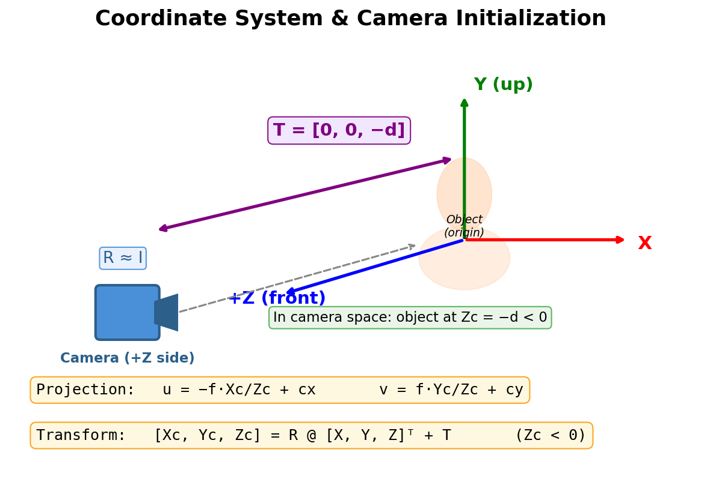

# Assignment 3 - Bundle Adjustment

### In this assignment, you will: (1) implement Bundle Adjustment from scratch using PyTorch, and (2) use COLMAP to perform full 3D reconstruction from multi-view images.

### Resources:
- [Teaching Slides](https://pan.ustc.edu.cn/share/index/66294554e01948acaf78)
- [Bundle Adjustment — Wikipedia](https://en.wikipedia.org/wiki/Bundle_adjustment)
- [PyTorch Optimization](https://pytorch.org/docs/stable/optim.html)
- [pytorch3d.transforms](https://pytorch3d.readthedocs.io/en/latest/modules/transforms.html)
- [COLMAP Documentation](https://colmap.github.io/)
- [COLMAP Tutorial](https://colmap.github.io/tutorial.html)

---

### Background

一个 3D 头部模型的表面上采样了 20000 个 3D 点，并从 50 个不同视角将这些点投影到 2D 图像上。你的任务是：仅根据这些 2D 观测，通过优化恢复出 **3D 点坐标、相机参数和焦距** — 这就是经典的 Bundle Adjustment 问题。

### Data

```
data/
├── images/              # 50 rendered views (1024×1024), for visualization & COLMAP
├── points2d.npz         # 2D observations: 50 keys ("view_000" ~ "view_049"), each (20000, 3)
└── points3d_colors.npy  # per-point RGB colors (20000, 3), for result visualization
```

`points2d.npz` 中每个 view 的数据形状为 **(20000, 3)**，每行格式为 `(x, y, visibility)`：
- `x, y`：该点在该视角下的像素坐标
- `visibility`：1.0 表示该点在该视角下可见，0.0 表示被遮挡

可参考 [visualize_data.py](visualize_data.py) 了解数据读取和可视化方式。

**Multi-view images & 2D projections:**


上排：50 个视角中的 5 个渲染图像；下排：对应视角的 2D 投影点叠加

### Known Information

| 参数 | 值 | 说明 |
|------|-----|------|
| Image Size | 1024 × 1024 | 图像分辨率 |
| Num Views | 50 | 视角数量（正前方 ±70° 范围） |
| Num Points | 20000 | 3D 点数量 |

---

## Task 1: Implement Bundle Adjustment with PyTorch

用 PyTorch 实现 Bundle Adjustment 优化，从 2D 观测恢复：
1. **相机内参**：焦距 f（所有相机共享）
2. **每个相机的外参** (Extrinsics)：旋转 R 和平移 T（共 50 组）
3. **所有 3D 点的坐标** (X, Y, Z)（共 20000 个）

#### 具体要求：

1. **实现投影函数**：根据相机内参和外参（R, T），将 3D 点投影到 2D 像素坐标。
2. **构建优化目标**：最小化 2D 重投影误差（predicted 2D - observed 2D 的距离）。
3. **参数化与优化**：使用 Euler 角参数化旋转（推荐），使用 PyTorch 的优化器（如 Adam）进行梯度下降。
4. **可视化与评估**：展示优化过程中 loss 的变化曲线，以及最终重建的 3D 点云（保存为带颜色的 OBJ 文件，颜色从 `points3d_colors.npy` 读取）。

**Expected result (reconstructed 3D point cloud):**



#### Coordinate System & Initialization



物体位于原点，正面朝 +Z 方向。相机在 +Z 侧面对物体正面。由于相机变换 `[Xc,Yc,Zc] = R @ P + T`，当 R ≈ I 时，物体相对于相机在 -Z 方向（Zc < 0），因此 T 初始化为 `[0, 0, -d]`。由于 Zc < 0，投影公式中 X 方向需要取负号来保证左右不翻转，而 Y 方向因为图像坐标 y 轴向下，恰好与负 Z 抵消，不需要取负号。

#### Hints:
- 投影公式：`u = -f * Xc/Zc + cx`，`v = f * Yc/Zc + cy`，其中 `[Xc, Yc, Zc] = R @ [X, Y, Z]^T + T`
- `cx = image_width / 2`，`cy = image_height / 2`，焦距 `f` 未知，需要优化
- 焦距初始化建议：对于常见的相机，FoV 一般在 30°~90° 之间，可由此估算 `f` 的合理范围（`f = H / (2 * tan(fov/2))`）
- 旋转矩阵推荐使用 **Euler 角**参数化（3个参数），PyTorch3D 提供了方便的转换函数：
  ```python
  from pytorch3d.transforms import euler_angles_to_matrix
  R = euler_angles_to_matrix(euler_angles, convention="XYZ")  # (*, 3) -> (*, 3, 3)
  ```
- 初始化建议：所有视角都在正前方附近，可以将相机旋转初始化为单位矩阵（Euler 角为零），平移初始化为 `[0, 0, -d]`（`d` 为合理的观测距离，如 2~3，负号表示相机在物体前方）；3D 点初始化在原点附近的随机位置
- 带颜色的 OBJ 格式：每行 `v x y z r g b`，其中 `r g b` 在 `[0, 1]` 范围内

---

## Task 2: 3D Reconstruction with COLMAP

使用 [COLMAP](https://colmap.github.io/) 命令行工具，对 `data/images/` 中的 50 张渲染图像进行完整的三维重建。

#### 具体步骤：

1. **特征提取** (Feature Extraction)
2. **特征匹配** (Feature Matching)
3. **稀疏重建** (Sparse Reconstruction / Mapper) — 即 COLMAP 内部的 Bundle Adjustment
4. **稠密重建** (Dense Reconstruction) — 包括 Image Undistortion、Patch Match Stereo、Stereo Fusion
5. **结果展示** — 在报告中展示稀疏点云或稠密点云的截图（可使用 [MeshLab](https://www.meshlab.net/) 查看 `.ply` 文件）

完整的命令行脚本见 [run_colmap.sh](run_colmap.sh)，可参考 [COLMAP CLI Tutorial](https://colmap.github.io/cli.html) 了解各步骤详情。

#### COLMAP 安装：
- **Linux**：参考 [官方安装文档](https://colmap.github.io/install.html) 从源码编译（需开启 CUDA 支持），或使用 `conda install -c conda-forge colmap`
- **Windows**：从 [COLMAP Releases](https://github.com/colmap/colmap/releases) 下载 `COLMAP-dev-windows-cuda.zip`，解压后将目录加入 PATH 即可使用

稠密重建需要 CUDA GPU；如无 GPU，可只完成到稀疏重建步骤。

---

### Requirements:
- 请自行环境配置，推荐使用 [conda 环境](https://docs.anaconda.com/miniconda/)
- Task 1 不提供代码框架，请自行设计代码结构
- 按照模板要求写 Markdown 版作业报告，包含 Task 1 和 Task 2 的结果
